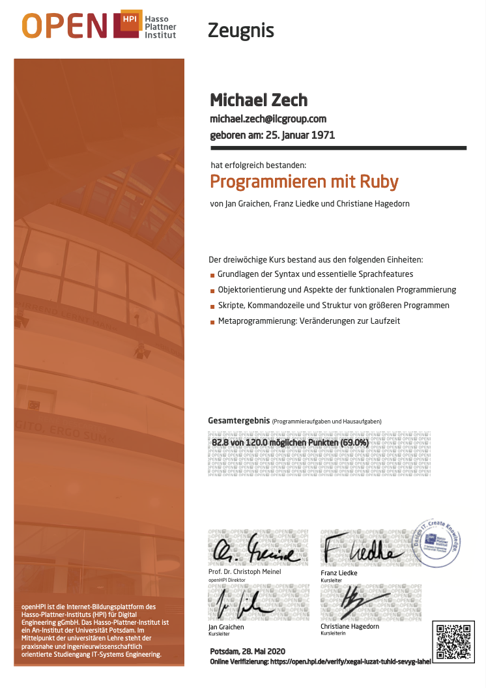

# OpenHPI Online-Kurs [Programmieren mit Ruby](https://open.hpi.de/courses/ruby2018)

## Hausaufgaben und Lehrmaterialien

## Notizen

**Syntax-Highlighting for Vim on MacOS**

1. Create a `.vimrc` file within your home-directory.
2. Add following lines to the `.vimrc` file:
   `filetype plugin indent on`
   `syntax on`
3. Turn syntax-highlighting on / off:
   `:syntax on`
   `:syntax off`

**Make a file executable**

1. `#!/usr/bin/env ruby`
2. `chmod u+x main.rb`
